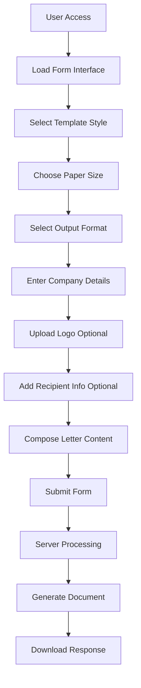
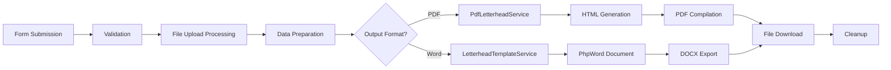

# Letterhead Generator Module Analysis

## Table of Contents
1. [Executive Summary](#executive-summary)
2. [Architecture Overview](#architecture-overview)
3. [Core Components Analysis](#core-components-analysis)
4. [Business Logic Flow](#business-logic-flow)
5. [Technical Implementation Details](#technical-implementation-details)
6. [Feature Specifications](#feature-specifications)
7. [Data Flow Analysis](#data-flow-analysis)
8. [Security Considerations](#security-considerations)
9. [Performance Analysis](#performance-analysis)
10. [Extension Points](#extension-points)
11. [Recommendations](#recommendations)

---

## Executive Summary

The Metasoft Letterhead Generator is a comprehensive Laravel-based web application designed to generate professional business letterheads in both PDF and Word formats. The module implements a sophisticated template system with four distinct design themes, supports multiple paper sizes including custom dimensions, and provides rich text editing capabilities for letter content.

### Key Capabilities
- **Multi-format Output**: PDF (via DomPDF) and Word (.docx via PhpWord) generation
- **Template System**: Four professional templates (Classic, Modern Green, Corporate Blue, Elegant Gray)
- **Paper Size Flexibility**: Standard sizes (US Letter, A4, Legal) plus custom dimensions
- **Rich Text Editing**: Summernote integration for WYSIWYG letter content editing
- **Logo Integration**: Automatic image processing with fallback to company name display
- **Recipient Management**: Optional recipient information with address handling

---

## Architecture Overview

### MVC Structure
```
Controller Layer: LetterheadController
├── Form Display (showForm)
└── Generation Logic (generateLetterhead)

Service Layer:
├── LetterheadTemplateService (Word Documents)
└── PdfLetterheadService (PDF Documents)

View Layer:
└── letterheads/form.blade.php (User Interface)

Routing Layer:
└── web.php (Route Definitions)
```

### Design Patterns
- **Service-Oriented Architecture**: Business logic encapsulated in dedicated services
- **Template Method Pattern**: Implemented in template generation methods
- **Factory Pattern**: Template selection based on user choice
- **Strategy Pattern**: Different output formats (PDF/Word) handled by separate services

---

## Core Components Analysis

### 1. LetterheadController (`app/Http/Controllers/LetterHeads/LetterheadController.php`)

**Responsibilities:**
- Request validation and sanitization
- File upload handling (logo processing)
- Service orchestration
- Response generation and file cleanup

**Key Methods:**
- `showForm()`: Renders the letterhead generation interface
- `generateLetterhead()`: Processes form submission and delegates to appropriate service

**Validation Rules:**
- Template selection: Restricted to predefined options
- Company information: Required name and address
- File uploads: Image validation with size limits (2MB max)
- Paper dimensions: Numeric validation for custom sizes
- Output format: PDF or Word selection

### 2. LetterheadTemplateService (`app/Services/LetterheadTemplateService.php`)

**Core Features:**
- PhpWord document generation for Microsoft Word output
- Four distinct template implementations
- Advanced typography and layout control
- Logo embedding with automatic resizing
- Rich text content processing with HTML-to-Word conversion

**Template Implementations:**
- `createClassicTemplate()`: Traditional business format with 1.5" margins
- `createModernGreenTemplate()`: Contemporary design with green accent colors
- `createCorporateBlueTemplate()`: Professional blue-themed layout
- `createElegantGrayTemplate()`: Sophisticated grayscale design

**Technical Highlights:**
- Paper size configuration using PhpWord Converter class
- Dynamic header height calculation (1/5 of paper height)
- Responsive logo sizing with fallback text rendering
- HTML content parsing with formatting preservation

### 3. PdfLetterheadService (`app/Services/PdfLetterheadService.php`)

**PDF Generation Features:**
- DomPDF integration with professional print settings
- HTML template generation with embedded CSS
- Base64 image encoding for logo embedding
- Summernote rich text content processing

**Template Structure:**
- CSS-based layouts with print optimizations
- Responsive design elements
- Color-coded template variants
- Professional typography settings

### 4. Form Interface (`resources/views/letterheads/form.blade.php`)

**User Experience Features:**
- Interactive template selection with visual previews
- Paper size selector with dimension specifications
- Output format toggle (PDF/Word)
- Rich text editor (Summernote) integration
- Real-time form validation
- Progressive enhancement with JavaScript

**Interface Components:**
- Template gallery with hover effects and selection indicators
- Company information input fields with validation
- Recipient information section (optional)
- File upload interface for logo handling
- Custom dimension inputs for non-standard paper sizes

---

## Business Logic Flow

### 1. User Journey


### 2. Processing Pipeline


### 3. Template Resolution Logic
```php
// Template mapping in LetterheadTemplateService
switch ($template) {
    case 'modern_green':
        return self::createModernGreenTemplate($phpWord, $data);
    case 'corporate_blue':
        return self::createCorporateBlueTemplate($phpWord, $data);
    case 'elegant_gray':
        return self::createElegantGrayTemplate($phpWord, $data);
    case 'classic':
    default:
        return self::createClassicTemplate($phpWord, $data);
}
```

---

## Technical Implementation Details

### Paper Size Management
```php
// Dynamic paper size configuration
public static function getPaperSizes(): array
{
    return [
        'letter' => [
            'name' => 'US Letter (8.5" × 11")',
            'width' => Converter::inchToTwip(8.5),
            'height' => Converter::inchToTwip(11)
        ],
        'a4' => [
            'name' => 'A4 (210mm × 297mm)',
            'width' => Converter::cmToTwip(21),
            'height' => Converter::cmToTwip(29.7)
        ],
        // Additional sizes...
    ];
}
```

### Logo Processing Logic
```php
// Intelligent logo handling with fallbacks
if (!empty($data['logo_path']) && file_exists($data['logo_path'])) {
    try {
        $logoSize = min(($headerHeight * 0.8) * 72, 100);
        $logoCell->addImage($data['logo_path'], [
            'width' => $logoSize,
            'height' => $logoSize,
            'alignment' => Jc::LEFT
        ]);
    } catch (Exception $e) {
        // Graceful degradation to text
        $logoCell->addText($data['company_name'], $textStyles);
    }
}
```

### Rich Text Processing
The module implements sophisticated HTML-to-document conversion:
- HTML parsing with regex-based content transformation
- List formatting preservation
- Text styling maintenance (bold, italic, underline)
- Paragraph spacing optimization

### File Management
- Temporary file creation in storage/app/public/temp
- Automatic cleanup using register_shutdown_function
- Memory-efficient streaming downloads
- File type validation and security checks

---

## Feature Specifications

### Template System
Each template variant includes:
- **Color Scheme**: Consistent branding colors throughout
- **Typography**: Professional font selections (Arial/Times New Roman)
- **Layout Structure**: Header/content/footer organization
- **Responsive Elements**: Dynamic sizing based on paper dimensions

### Paper Size Support
- **Standard Sizes**: US Letter, A4, Legal with predefined dimensions
- **Custom Dimensions**: User-defined width (1-20") and height (1-30")
- **Unit Conversion**: Automatic conversion between inches, points, and twips
- **Margin Optimization**: Template-specific margin calculations

### Content Management
- **Rich Text Editing**: Summernote WYSIWYG editor integration
- **HTML Processing**: Server-side HTML cleaning and optimization
- **Placeholder System**: Template variables for dynamic content
- **Formatting Preservation**: Maintains user formatting in output documents

---

## Data Flow Analysis

### Input Data Structure
```php
$data = [
    'company_name' => string,      // Required
    'address' => string,           // Required (multiline)
    'phone' => string|null,        // Optional
    'email' => string|null,        // Optional (validated)
    'website' => string|null,      // Optional (URL validated)
    'logo_path' => string|null,    // Optional (file path)
    'recipient_name' => string|null,
    'recipient_title' => string|null,
    'recipient_address' => string|null,
    'letter_content' => string|null,
    'paper_size' => enum,          // letter|a4|legal|custom
    'custom_width' => float|null,  // Required if custom
    'custom_height' => float|null, // Required if custom
    'output_format' => enum        // pdf|word
];
```

### Output Generation
- **PDF**: Binary PDF stream with appropriate MIME headers
- **Word**: DOCX binary stream with Office Open XML format
- **Filename**: Dynamic naming with template and timestamp
- **Headers**: Proper download headers for browser handling

---

## Security Considerations

### File Upload Security
- **MIME Type Validation**: Restricted to image formats (JPEG, PNG)
- **File Size Limits**: Maximum 2MB upload size
- **Temporary Storage**: Files stored in secured temporary directory
- **Automatic Cleanup**: Files removed after processing

### Input Validation
- **XSS Prevention**: HTML input sanitization in rich text editor
- **SQL Injection**: Laravel's built-in parameter binding
- **File Path Security**: Absolute path resolution prevents directory traversal
- **Content Filtering**: HTML tag filtering in content processing

### Authentication
- **Route Protection**: Middleware authentication required
- **Session Management**: Laravel's session handling
- **CSRF Protection**: Token validation on form submissions

---

## Performance Analysis

### Optimization Features
- **Memory Management**: Streaming downloads for large files
- **Resource Cleanup**: Automatic temporary file removal
- **Efficient Processing**: Single-pass HTML parsing
- **Caching Potential**: Template configurations could be cached

### Scalability Considerations
- **Stateless Processing**: No session state during generation
- **Resource Limits**: Configurable memory and execution time limits
- **Concurrent Handling**: Multiple users can generate simultaneously
- **Storage Efficiency**: Temporary files minimize storage usage

---

## Extension Points

### Template System Extensions
1. **New Templates**: Additional template methods following existing patterns
2. **Theme Customization**: Color scheme parameterization
3. **Layout Variants**: Alternative header/footer configurations
4. **Brand Integration**: Corporate identity template modifications

### Format Extensions
1. **Additional Formats**: HTML, RTF, or other document formats
2. **Print Optimization**: Specialized print-ready formats
3. **Email Integration**: Email-friendly HTML generation
4. **Digital Signatures**: Electronic signature integration

### Feature Enhancements
1. **Template Preview**: Real-time preview generation
2. **Batch Processing**: Multiple letterhead generation
3. **Template Management**: Admin interface for template customization
4. **Version Control**: Template versioning system

---

## Recommendations

### Immediate Improvements
1. **Error Handling**: Enhanced error messaging and logging
2. **Unit Testing**: Comprehensive test coverage for all services
3. **Configuration**: Environment-based template customization
4. **Documentation**: API documentation for service methods

### Medium-term Enhancements
1. **Template Builder**: Visual template editor interface
2. **Asset Management**: Centralized logo and asset storage
3. **Export History**: User generation history and re-download
4. **Mobile Optimization**: Responsive design improvements

### Long-term Evolution
1. **Multi-tenancy**: Organization-specific template libraries
2. **API Integration**: RESTful API for external integration
3. **Cloud Storage**: S3-compatible storage integration
4. **Analytics**: Usage analytics and reporting features

---

## Conclusion

The MetaSOFT Letterhead Generator represents a well-architected, feature-rich solution for professional document generation. The modular design, comprehensive template system, and dual-format output capabilities provide a solid foundation for business letterhead creation. The implementation demonstrates strong separation of concerns, proper error handling, and user-focused design principles.

The module successfully balances functionality with maintainability, offering clear extension points for future enhancements while maintaining code quality and security standards.